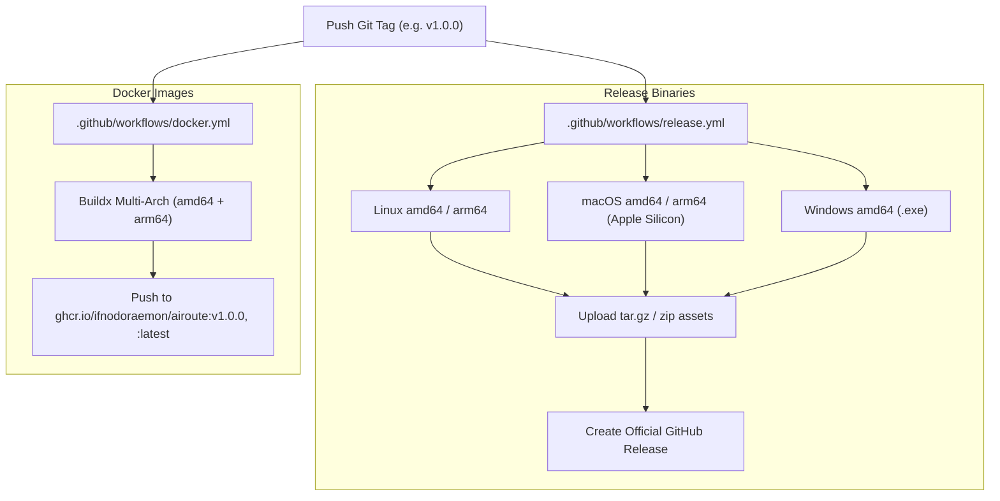

# Airoute Release & Versioning Specification (发布与版本管理规范)

本文档制定了 Airoute 项目在 GitHub 上的标准化 Release 与 Git Tag 生命周期管理流程，遵循 **Semantic Versioning 2.0.0 (语义化版本规范)** 与云原生工程最佳实践。

---

## 1. 语义化版本规则 (SemVer 2.0.0)

版本号格式定义为：`vMAJOR.MINOR.PATCH`（例如：`v1.0.0`）

| 版本类型 | 升级原则 | 示例场景 | 升级前缀 |
| :--- | :--- | :--- | :--- |
| **MAJOR (主版本)** | 包含不向后兼容的重大架构重构或契约变更 | 数据库 Schema 不兼容变更、网关协议核心契约废弃 | `v2.0.0` |
| **MINOR (次版本)** | 向后兼容的新特性、新协议支持或重大工程优化 | 新增模型格式校验引擎、新增自研适配器模式、高精度财务计费改造 | `v1.1.0` |
| **PATCH (修订版本)** | 向后兼容的 Bug 修复、安全加固或长尾边缘情况处理 | 修复某上游 Provider 流式 index 漏传、浮点数舍入微调 | `v1.0.1` |

---

## 2. 自动化发布流水线 (CI/CD Matrix)

当向 GitHub 仓库推送符合 `v*` 或 `v*.*.*` 格式的 Git Tag 时，GitHub Actions 会自动触发以下流水线：



---

## 3. 标准发版操作流程 (Standard Release Workflow)

### 第一步：全量单元与集成测试验证
确保本地代码库测试 100% 通过且工作区干净：
```bash
go test -count=1 ./...
```

### 第二步：提交代码并推送到主分支
遵循 [Conventional Commits](https://www.conventionalcommits.org/) 规范编写提交信息：
```bash
git add .
git commit -m "feat(validator): introduce precision engineering, protocol adapters, and default-off validation"
git push origin main
```

### 第三步：打附注标签 (Annotated Git Tag)
必须创建带有详细发布摘要的 Annotated Tag（避免使用轻量级标签）：
```bash
# 创建带有说明的发布标签
git tag -a v1.0.0 -m "Release v1.0.0: Production-grade multi-protocol AI gateway with precision engineering and protocol adapters"

# 推送 Tag 到远程仓库以触发自动化发布
git push origin v1.0.0
```

### 第四步：GitHub Release 发布记录 (Release Notes)
流水线完成编译后，可通过 GitHub 网页控制台或 `gh` 命令行工具撰写 Release Notes：
```markdown
## What's Changed
### 🌟 New Features & Enhancements
- **Protocol Validation Engine**: Configurable OpenAI, Anthropic, and Gemini schema validation (defaults to `off` with granular per-model and per-key overrides).
- **Precision Engineering**: 8-decimal fixed-point billing rounding, overdraft pre-reserve protection, P50/P90/P99 latency histogram telemetry.
- **Design Patterns Refactoring**: Implemented Protocol Adapter Pattern for bi-directional protocol transformation and State Pattern for Circuit Breaker.
- **Terminology Normalization**: Unified all internal references from VirtualKey to standard APIKey.

### 📦 Artifacts
- Cross-platform standalone binaries (Linux, macOS, Windows).
- Multi-architecture container image: `ghcr.io/ifnodoraemon/airoute:v1.0.0`
```

---

## 4. 应急与热修复分支策略 (Hotfix & Rollback)

若生产环境已发布的 `v1.0.0` 出现紧急缺陷：
1. 基于该 Tag 创建修复分支：
   ```bash
   git checkout -b hotfix/v1.0.1 v1.0.0
   ```
2. 修复并经过测试后，打补丁标签：
   ```bash
   git commit -m "fix(billing): correct precision rounding edge case"
   git tag -a v1.0.1 -m "Hotfix v1.0.1: Fix precision rounding edge case"
   git push origin v1.0.1
   ```
3. 将修复合并回 `main` 主分支保持同步。
